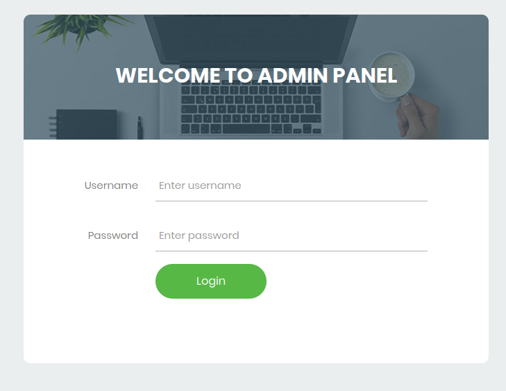

## Online Examination System Project in PHP

- Name of Project:     Online Examination System
- Language:            PHP
- Databases used:      My SQL
- Design used:         HTML JavaScript, CSS3
- Browser used:        IE8, Google Chrome, Opera Mozilla
- Software used:        WAMP/ XAMPP/ LAMP/MAMP / Laragon

Manage Course
- Course
- Course Manage
Manage Exam
- Exam
- Manage Student
- Add Student
- Manage Student
Reports
- Feedbacks
Dashboard: Examiner All Exam
- Approved by Admin
- Exam Again
Feedbacks
- Feedback Adds

### How to setup this project
- Step 1st. Download xampp / WAMP and Install
- Step 2nd. Text editor Vs Code
- Step 3rd. Download the zip file/ Download winrar
- Step 4th. Extract the file and copy “Download Folder” folder
- Step 5th. Paste inside root directory/ where you install xampp/ WAMP local disk C: drive D: drive E: paste: for xampp/htdocs,
- Step 6th. Open PHPMyAdmin http://localhost/phpmyadmin
- Step 7th. Create database name "online_exam_db"
- Step 8th. Import "online_exam_db.sql" file given inside the zip package in SQL file folder
- Step 9th. Run the script http://localhost/"Folder"
- Step 10th. Admin Panel to Go -> "http://localhost/'Folder Location'/adminpanel/admin"
- Step 11th. Login Admin Panel / Student Panel.

### Admin Panel And Student Panel Login Info

admin Username: Admin   Password: Openforme

## Admin Panel

 
  
 
